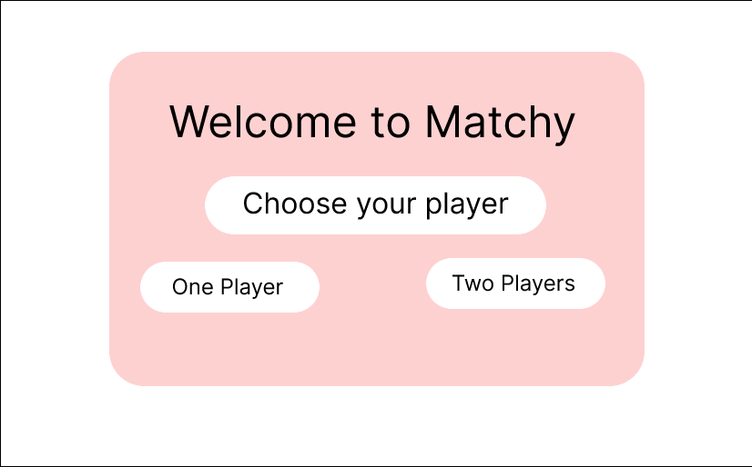
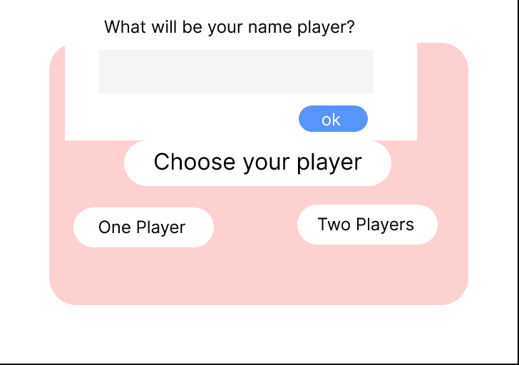
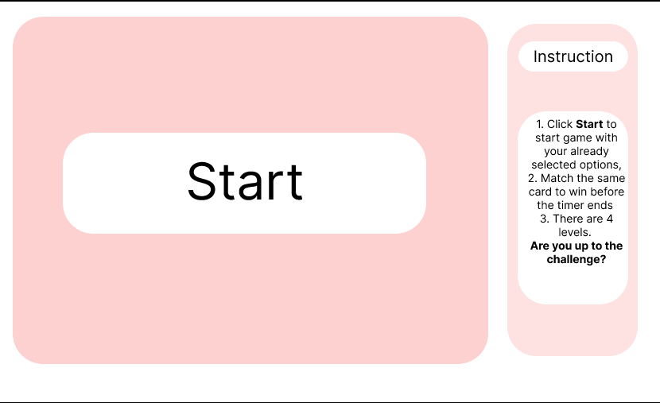
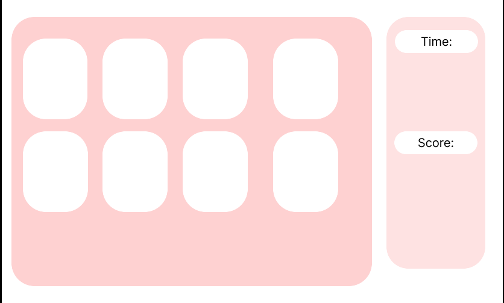

# Matchy Game
## Game Description
Matchy is a One Player/ Two Players Option Matching Game that allows the player/players to input their names, and choose their level of difficulty. One Player Option you'll be trying to match all the cards before the timer ends. In the Two Players Option, you'll be trying to earn a higher score than your opponent. The game will also indicate a winner or loser at the end.
## Wireframe

* If you like to see more of my wireframe, click [here](https://www.figma.com/file/hnNus3wYFm4CGsplWfH2h3/Matchy-Game-Wireframe?node-id=0%3A1)

## User Stories
* User/ Users will be greeted by the Welcome Page.
* To Start the prompts user will click on either One Player/ Two Players.
* User will be alerted what Player Option they selected.
* User will be able to input user's names and difficulty options.
* User will then Click the Start button to generate the game level based on the previously selected choice.
* To win the game for One Player, the user must match all the cards before the timers. If they click correctly the game will alert you have a match, cards will disappear and you will recieve a point. If user select incorrectly cards, you will be alert of the mistake and the card will flip over. 
* To win the game for Two Players, the users earn a higher score than their opponent. 
* During the game the user/ users will be able to see their score and timer on the right side of the page.
* The user will be able to toggle the instruction button whenever they need the rules.
* The user will be able click the Reset button if the game is over and send them back to the beginning of the game.
